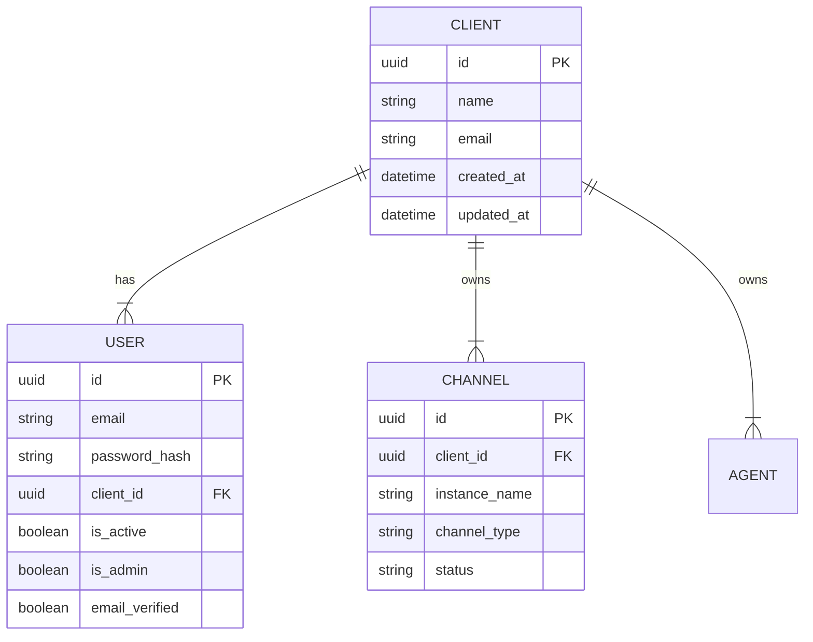

# Plan: Add Password Change for Client Users

## Current Analysis

### Why No Password Option in Client Edit?

The issue is architectural: **Client** and **User** are separate entities in the system.

### Current Architecture



### Current Behavior

| Feature | Endpoint | What it does | Missing? |
|---------|----------|--------------|----------|
| Edit Client | `PUT /clients/{client_id}` | Updates Client fields (name, email) | ✅ Working |
| Change Own Password | `POST /auth/change-password` | User changes own password (requires current password) | ✅ Working |
| **Reset Client Password** | ❌ **Not exists** | Admin resets/changes client user's password | ❌ **Missing** |

### Why It Works This Way

1. **Separation of Concerns**: Client represents a "business account", User represents login credentials
2. **Multiple Users per Client**: Architecture allows multiple users per client (though current implementation uses 1:1)
3. **Security**: Password changes require verification of current password for self-changes

---

## Problem Statement

**When editing a client in the UI, there is no option to change/reset the client user's password.**

This is problematic for administrators who need to:
- Reset a forgotten password for a client
- Compromise a compromised account by forcing password reset
- Initially set passwords for newly created clients

---

## Proposed Solution

### Option 1: Add Admin Password Reset Endpoint (Recommended)

Create a new endpoint that allows administrators to reset/change a client user's password without requiring the current password.

#### Implementation Plan

**Backend Changes:**

1. **Add new schema in [`schemas/user.py`](evo-ai/src/schemas/user.py)**:
```python
class AdminPasswordReset(BaseModel):
    client_id: UUID = Field(..., description="Client ID whose user password will be reset")
    new_password: str = Field(..., min_length=8, description="New password")
```

2. **Add service function in [`services/user_service.py`](evo-ai/src/services/user_service.py)**:
```python
def admin_reset_client_password(
    db: Session,
    client_id: uuid.UUID,
    new_password: str,
    admin_user_id: uuid.UUID
) -> Tuple[bool, str]:
    """Allows admin to reset password for a client's user"""
```

3. **Add endpoint in [`api/client_routes.py`](evo-ai/src/api/client_routes.py)**:
```python
@router.post("/{client_id}/reset-password")
async def admin_reset_client_user_password(
    client_id: uuid.UUID,
    password_data: AdminPasswordReset,
    db: Session = Depends(get_db),
    payload: dict = Depends(get_jwt_token)
):
```

**Frontend Changes:**

4. Add password reset form to client edit page at [`frontend/app/clients/page.tsx`](evo-ai/frontend/app/clients/page.tsx)
5. Show this form only to admins
6. Add confirmation dialog before password reset

### Option 2: Extend Client Update Endpoint

Add optional password field to the `PUT /clients/{client_id}` endpoint.

**Pros:**
- Single endpoint for client-related changes
- Simpler UI flow

**Cons:**
- Mixing concerns (Client vs User data)
- Less explicit security boundary
- May cause confusion about what belongs to Client vs User

**Recommendation:** **Do NOT use this option** - it violates separation of concerns.

### Option 3: Dedicated User Management for Clients

Create a separate section for managing users associated with clients.

**Pros:**
- Clearer architecture
- Supports future multiple users per client
- Consistent with system design

**Cons:**
- More initial work
- May be overkill for current 1:1 relationship

**Recommendation:** Good for future, but **Option 1 is better** for immediate needs.

---

## Detailed Implementation: Option 1

### Step 1: Add Schema

**File:** [`evo-ai/src/schemas/user.py`](evo-ai/src/schemas/user.py:89)

```python
class AdminPasswordReset(BaseModel):
    """Schema for admin to reset a client user's password"""
    client_id: UUID = Field(..., description="Client ID whose user password will be reset")
    new_password: str = Field(..., min_length=8, description="New password to set")
```

### Step 2: Add Service Function

**File:** [`evo-ai/src/services/user_service.py`](evo-ai/src/services/user_service.py:525)

```python
def admin_reset_client_password(
    db: Session,
    client_id: uuid.UUID,
    new_password: str,
    admin_user_id: uuid.UUID
) -> Tuple[bool, str]:
    """
    Allows an administrator to reset the password of a client's associated user.
    
    This is an admin-only function that does not require the current password.
    
    Args:
        db: Database session
        client_id: ID of the client
        new_password: New password to set
        admin_user_id: ID of the admin performing the reset (for audit)
    
    Returns:
        Tuple[bool, str]: Success status and message
    """
    try:
        # Find client
        client = db.query(Client).filter(Client.id == client_id).first()
        if not client:
            logger.warning(
                f"Admin {admin_user_id} attempted to reset password for non-existent client: {client_id}"
            )
            return False, "Client not found"
        
        # Find user associated with this client
        user = db.query(User).filter(User.client_id == client_id).first()
        if not user:
            logger.warning(
                f"Admin {admin_user_id} attempted to reset password for client {client_id} with no user"
            )
            return False, "No user associated with this client"
        
        # Update password
        user.password_hash = get_password_hash(new_password)
        
        # Invalidate password reset tokens for security
        user.password_reset_token = None
        user.password_reset_expiry = None
        
        db.commit()
        
        logger.info(
            f"Admin {admin_user_id} successfully reset password for user {user.email} (client: {client.name})"
        )
        return True, "Password reset successfully"
    
    except SQLAlchemyError as e:
        db.rollback()
        logger.error(f"Error in admin password reset: {str(e)}")
        return False, f"Error resetting password: {str(e)}"
    
    except Exception as e:
        logger.error(f"Unexpected error in admin password reset: {str(e)}")
        return False, f"Unexpected error: {str(e)}"
```

### Step 3: Add API Endpoint

**File:** [`evo-ai/src/api/client_routes.py`](evo-ai/src/api/client_routes.py:216)

```python
@router.post("/{client_id}/reset-password", response_model=MessageResponse)
async def admin_reset_client_user_password(
    client_id: uuid.UUID,
    password_data: AdminPasswordReset,
    db: Session = Depends(get_db),
    payload: dict = Depends(get_jwt_token),
):
    """
    Allows an administrator to reset the password of a client's associated user.
    
    This endpoint does not require the current password and is admin-only.
    
    Args:
        client_id: ID of the client
        password_data: New password data
        db: Database session
        payload: JWT token payload
    
    Returns:
        MessageResponse: Success message
    
    Raises:
        HTTPException: If user is not admin or operation fails
    """
    # Only administrators can perform this action
    await verify_admin(payload)
    
    # Verify client_id matches
    if password_data.client_id != client_id:
        raise HTTPException(
            status_code=status.HTTP_400_BAD_REQUEST,
            detail="Client ID in path does not match client ID in body"
        )
    
    # Get admin user ID for audit logging
    admin_user_id = payload.get("user_id")
    
    # Perform password reset
    success, message = user_service.admin_reset_client_password(
        db, client_id, password_data.new_password, admin_user_id
    )
    
    if not success:
        raise HTTPException(
            status_code=status.HTTP_400_BAD_REQUEST,
            detail=message
        )
    
    # Log the action in audit log
    from src.services.audit_service import create_audit_log
    create_audit_log(
        db,
        user_id=admin_user_id,
        action="reset_user_password",
        resource_type="client_user",
        resource_id=str(client_id),
        ip_address=payload.get("ip"),
        user_agent=payload.get("user_agent")
    )
    
    return {"message": message}
```

### Step 4: Frontend Implementation

**File to modify:** [`frontend/app/clients/page.tsx`](evo-ai/frontend/app/clients/page.tsx)

Add a password reset section to the client edit dialog:

```typescript
// Inside the client edit dialog/component
{currentUserIsAdmin && (
  <div className="mt-4 border-t pt-4">
    <h3 className="text-sm font-semibold mb-2">Security Actions</h3>
    <div className="space-y-2">
      <Label htmlFor="new-password">Reset User Password</Label>
      <Input
        id="new-password"
        type="password"
        placeholder="Enter new password (min. 8 characters)"
        onChange={(e) => setNewPassword(e.target.value)}
      />
      <Button
        variant="destructive"
        onClick={() => showPasswordResetConfirm()}
        disabled={!newPassword || newPassword.length < 8}
      >
        Reset Password
      </Button>
    </div>
  </div>
)}
```

---

## Security Considerations

### Implemented Safeguards

1. **Admin-Only Access**: Endpoint protected by `verify_admin()` middleware
2. **Audit Logging**: All password reset actions logged with admin ID
3. **Token Invalidation**: Old password reset tokens are cleared
4. **Password Requirements**: Enforced by Pydantic validation (min 8 characters)

### Additional Recommendations

1. **Email Notification**: Send email to client user informing password was changed by admin
2. **Force Password Change**: Add flag to require user to change password on next login
3. **Session Invalidation**: Invalidate all existing sessions after password change

---

## Testing Checklist

- [ ] Admin can reset client user password
- [ ] Non-admin receives 403 error when attempting
- [ ] Password validation works (min 8 characters)
- [ ] Audit log is created after successful reset
- [ ] Email notification is sent (if implemented)
- [ ] Client user can login with new password
- [ ] Old passwords no longer work

---

## Summary

The lack of password change option in client edit is **by design** - Client and User are separate entities. The solution is to add an **admin-only endpoint** for resetting client user passwords without requiring the current password.

**Recommended Approach:** Option 1 - Add `POST /clients/{client_id}/reset-password` endpoint.

**Next Steps:**
1. Create the schema, service, and endpoint as described
2. Add backend audit logging integration
3. Implement frontend UI for admins
4. Add unit and integration tests